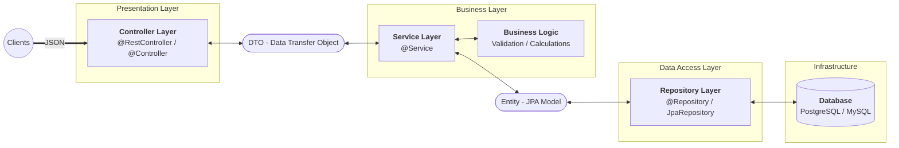

# SpringBoot

## HISTORY

- Servlet Era (Foundation)
  - Working:
    - Servlet - Java class that handles request, processes and returns responses.
    - Servlet Container: it manages its entire life through three main methods:
      - init(): Called once when the servlet is first loaded.
      - service(): Called for every request (dispatching to doGet, doPost, etc.).
      - destroy(): Called when the server shuts down.
  - Flow:
    ```mermaid
    flowchart LR
        Client((Client)) -- HTTP Request --> Container[Servlet Container/Tomcat]
        Container -- 1. Check web.xml/Annotations --> Map{Mapping}
        Map -- 2. Instantiate/Use --> Servlet[Servlet Instance]
        Servlet -- 3. Logic --> Response
        Response -- 4. HTTP Response --> Client
    ```
- Spring Framework (Orchestrator):
  - Features:
    - IOC & DI:
      - Inversion Of Control: Framework controls the flow not code.
      - Dependency Injection: The pattern where the Spring Container (ApplicationContext) "injects"
        dependencies into your classes. You stop using the new keyword for services.
    - Aspect-Oriented Programming (AOP):
      - Allows you to separate "cross-cutting concerns" like Logging, Security, and Transactions so they don't
        clutter your business logic.
    - The Front Controller Pattern:
      - Spring MVC uses a single entry point called the DispatcherServlet. It acts as a traffic cop.
  - Flow:
    ```mermaid
      flowchart LR
          Client((Client)) --> DS[Dispatcher Servlet]
      DS --> HM[Handler Mapping: Which Controller?]
      HM --> DS
      DS --> Controller[Controller/Handler]
      Controller --> Service[Service Layer/Business Logic]
      Service --> DS
      DS --> VR[View Resolver/JSON Converter]
      VR --> Client
    ```

- SpringBoot
  - Opinionated Framework.Makes assumption on what you need so no need to start from scratch.
  - Features:
    - Starters: POM dependencies that bundle everything needed for a specific task (e.g., spring-boot-starter-web
      includes Tomcat, Jackson, and Spring MVC).
    - Auto-Configuration: The @EnableAutoConfiguration magic. If Spring Boot sees _h2.jar_ on your classpath, it
      automatically sets up an in-memory database bean for you.
    - Fat JARs: It packages your code and the server (Tomcat/Jetty) into one executable file. You no longer "deploy
      to a server"; the server is inside your app.

## Setting Up SpringBoot Project

### Steps

1. Go to start.spring.io in browser
2. Select: Maven, Java, Spring Boot 3.3.x
3. Dependencies: Spring Web [Tomcat for Rest API], Spring Data JPA [ORM for Data], PostgreSQL Driver, Lombok
4. Group: com.pagaar
5. Artifact: pagaar
6. Click Generate → Unzip → Open in IntelliJ

### Layered Architecture



- SpringBoot Application:
  - Controller Layer:
    - @RequestMapping/@RestController
    - Handles HTTP Requests. Should talk to service layer and return/receive DTOs.
  - Service Layer:
    - @Service, @Transactional
    - Core Business Logic lives here.
    - Maps DTO to Entities (and vice-versa).
    - DB logic hidden from web layer
  - Repository Layer:
    - @Repository
    - Performs CRUD Operations. Only deal with `Entities`.
  - Utils/Config:
    - @Configuration/@Component
    - Contains security configs, bean definitions, and mapping utilities.

### Packaging

JAR (Java Archive): Standalone JAVA Application
WAR (Web Archive): Spring Servelets

### Dependencies

Spring Web: TomCat for REST API
JPA: ORM
Auth: Authentication

## MAVEN & LIFECYCLE

## BEAN & ITS LIFECYCLE

Bean - Object in Java. It is run over Spring Container (IOC Container).

Ways to create:

1. @Component
2. @Bean

## SpringBoot Annotations

- @Controller
- @RestController
- @ResponseBody
- @RequestMapping
- @RequestParam
- @PathVariable
- @RequestBody
- @ResponseEntity

## Dependency Injection

---

## SpringBoot Application Architecture Patterns

Start with good enough architecture and evolve as you go.

- Event Management System (sample)
  - Create events
  - List events
  - View event details
  - Cancel event
  - Register for an event
  - Cancel registration
  - Get the list of attendees for an event
  - Get the status of a user's registration for an event
  - Get the list of user's upcoming events and past attended events

### Layered

- Layered architecture using the package-by-layer approach
- Code is structured by technical layers (Controller, Service, Repository, Mapper, etc.)
  Means: We
- Used primitive types (String, Integer, etc.) instead of Domain Types (Value Objects)
  Means: No Specific Domain Class was created.
- Used JPA entities as Domain Models
- Anemic Domain Models with Transaction Script Pattern

### Package by module

### Modular Monolith Simple

### Modular Monolith Tomato

### Modular Monolith DDD Hexagonal Architecture

## Building App

### Setting Up

1. Project Settings:
   JDK - Free Community or Commercial (Oracle) or Performance (GraalVM)
   SDK - physical code downloaded on system.
   Language Level - You can switch to old versions.

2. Manage Dependency
   - Change `pom.xml`
   - run `mvn clean install`
   - right click -> sync project

3. resources
   - SubFolder containing:
     - db.migration
     - application.properties

### Execution

1. Dependencies
   We define dependencies such as TomCat Server, Redis, Kafka in pom.xml.
2. Auto-Configuration
   When we click run:
   Maven packages code + external libraies into one big exceutable JAR. (Fat/Uber JAR)
   SB scans for @Configuration and beans are defined.
3. IoC Startup
   IoC Container starts up and instantiates the beans.
   Infra first: tomcat webserver
   Connection: Redis, Kafka
   Code last:
4. Live
   Ioc Container is routing the requests here.
   Tomcat is listening, redis is spinning, code is working
   Summary: Dependencies → Maven Build → Spring Boot Auto-Config → IoC Instantiation → Services Live.

### Controller

Entry Point for all routes.

Annoations:

- @Controller:
  - Used when serving Static HTML Views.
  - returns String

- @RestController
  - Used when serving Data(JSON/XML).
  - Returns An Object
